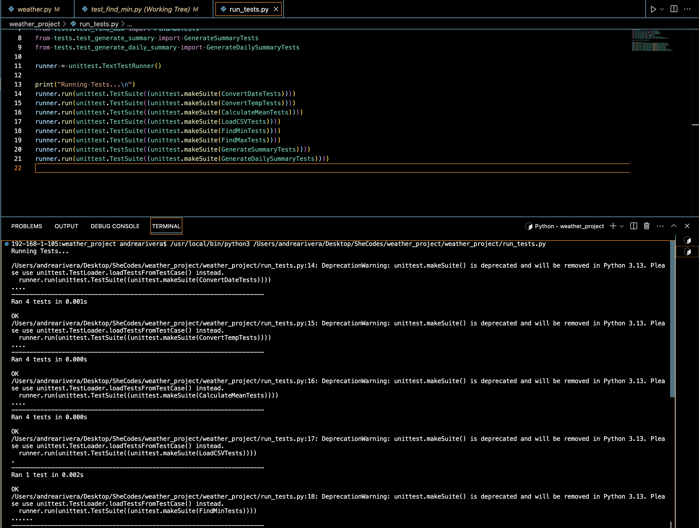
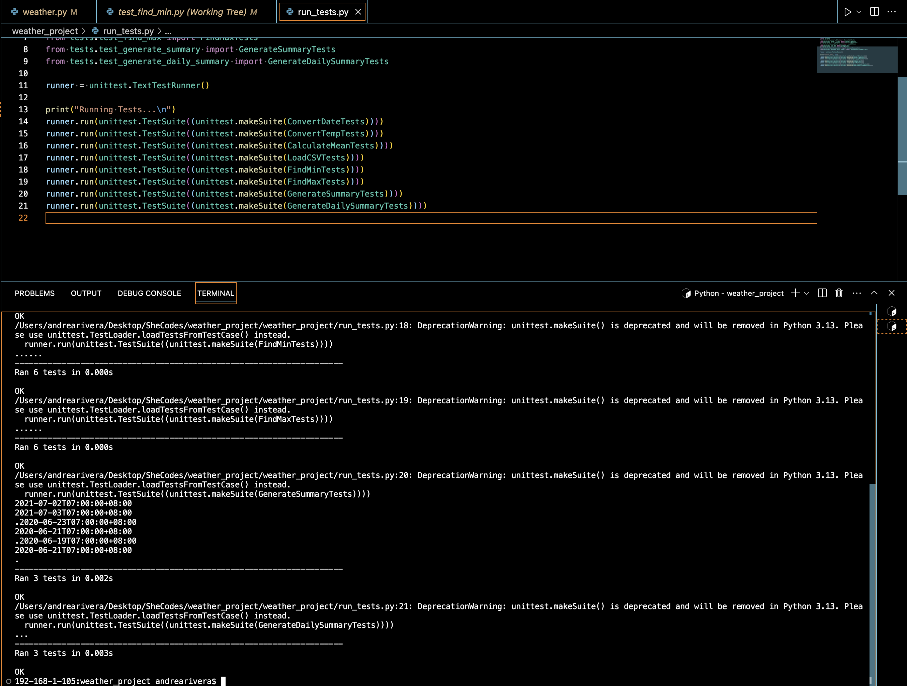

#  Andrea del Pilar Rivera Pena- Python Task
# Weather Project.

## Project Description

## Content
Everyday we collect data about the weather in order to predict the forecast for thecoming days. The problem is that this data is never in a human readable format, My task is to process csv files containing data about the weather,and convert them into meaningful text-based summaries.

### Technical
Inside this repo, the weather.py file contains several functions, most which had to be completed by me. It has “docstring” to help me to understand what each function has to do.Also, a run_tests.py file is provided, and also tests/ directory. I will not be running the weather.py file, instead, the tests will run it for me all the functions and check is the answer my answer is correct compared to the answer already saved in the run_test.py files.

### Screenshots
>My Wireframe screenshots are the following:

